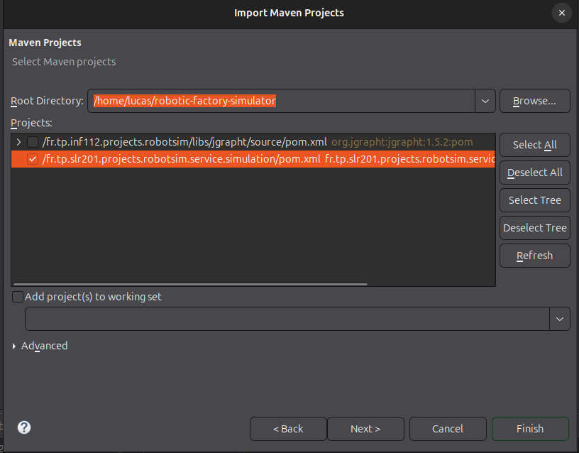
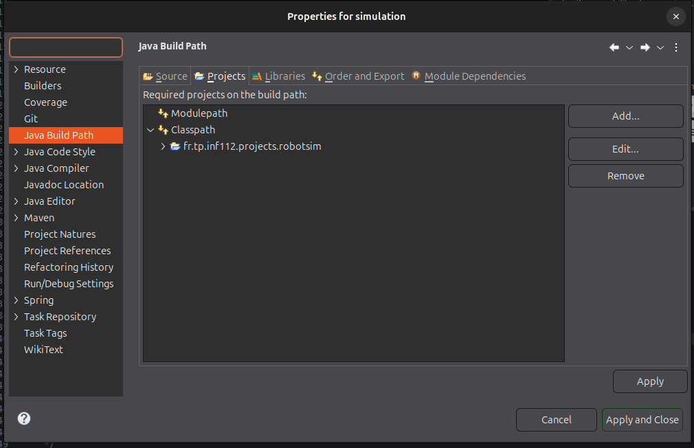

# Robotic Factory Simulator
Student: Lucas Freire Costa

Professor: Dominique Blouin

**How import and execute the project**:
- First, you need to import `fr.tp.inf112.projects.robotsim` in General > Existing Projects into Workspace;

- Then, you need to import `fr.tp.slr201.projects.robotsim.service.simulation` in Maven > Existing Maven Projects (select only the main folder)

- Finally, you need to add in the build path of the `fr.tp.slr201.projects.robotsim.service.simulation`
the `fr.tp.inf112.projects.robotsim` project.

**Notes**:
- You must save the factory model locally before starting the simulation so the server can read the file from disk.